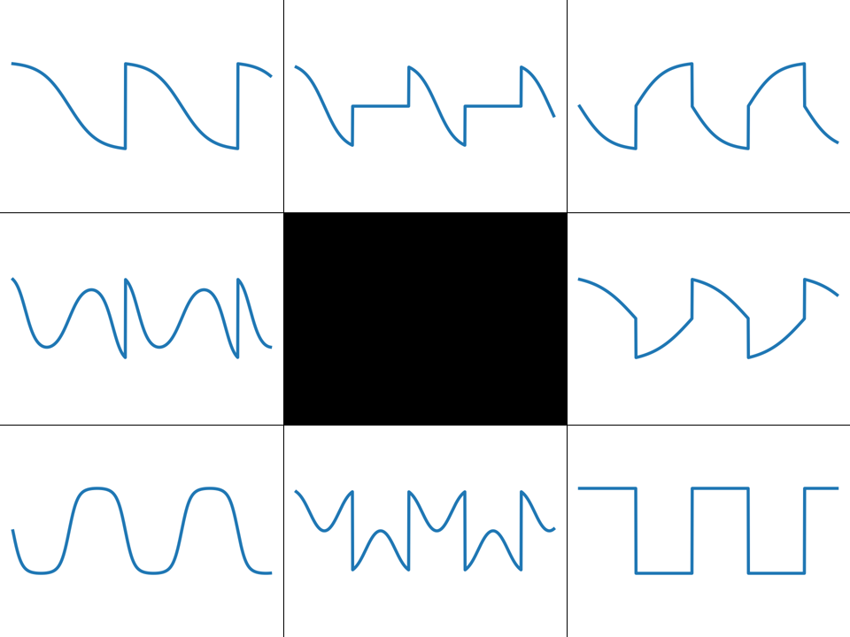

# cached dilated causal convolutions

neural net running at 192kHz to wave shape input quadrature X into 4 different soft clip waves based on additional input 2d embedding



### inputs

```
0 core sine wave waveshaping input
1 core cosine wave waveshaping input ( normalled to phase shfted estimate from in0 )
2 embedding x
3 embedding y
```

### outputs

```
0 waveshaped result ( with small amount of low pass filtering )
1 raw waveshaped result
2 -
3 cosine estimated from in0 sine
```

## modulation

* support audio rate modulation of all inputs
* trained on core sine wave, but takes any wave as input
* the in1 derived from phase shifted in0 can be noisy under heavy in0 FM

## model

* inference runs at 192kHz
* pretrain at FP 3.15, fine tune at FP 3.5
* receptive field of 4096 samples => ~9 cycles of a 440Hz wave at 192kHz    
* pretrain with MSE with ramped up STFT losses; finetune with just MSE
* trained on synthetic sampled data at frequencies between A2 to A6
* receptive field of 1024 samples ( => ~2.3 cycles of a 440Hz wave at 192kHz )
* double width biases and accumulation
* EBR activation caching

```
 Layer (type)                Output Shape      Param #
==========================================================
 input_1 (InputLayer)        (None, 4096, 4)   0
 qconv_0_qb (QConv1D)        (None, 1024, 8)   136
 qconv_1_qb (QConv1D)        (None, 256, 16)   528
 qconv_2_qb (QConv1D)        (None, 64, 16)    1040
 qconv_3_qb (QConv1D)        (None, 16, 8)     520
 qconv_4_qb (QConv1D)        (None, 4, 8)      264
 qconv_5_qb (QConv1D)        (None, 1, 1)      33
==========================================================
Total params: 2521 (9.85 KB)
```

### synthesis result...

( FP3.5 at 192kHz )

```
DP16KD:75%  MULT18X18D:46%  ALU54B:0%  TRELLIS_FF:54%  TRELLIS_COMB:61%
Info: Router1 time: 0h 01m 06s
Info:  '$glbnet$audio_clk': 65.58 MHz (PASS at 50.00 MHz)
Info:        '$glbnet$clk': 79.65 MHz (PASS at 60.00 MHz)
```

### demo

https://youtu.be/euxx77Tvml8