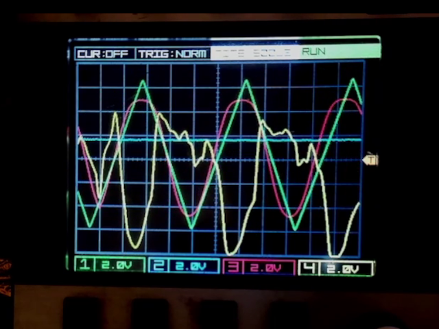

[](https://youtu.be/GyWBLa5KGUc&cc_load_policy=1)

changes compared to verilog_version

* all stream based; FP4.12 for all the neural net math
* dynamic sizing based on qkeras weights
* Memory or Array (EBR) based activation caches
* pipelining for the elements of the multiply

qkeras model is...

```
Layer (type)                Output Shape              Param #
=================================================================
 input_1 (InputLayer)        (None, 256,  4)          0
 qconv_0_qb (QConv1D)        (None,  64,  4)          68
 qconv_1_qb (QConv1D)        (None,  16,  8)          136
 qconv_2_qb (QConv1D)        (None,   4, 16)          528
 qconv_3_qb (QConv1D)        (None,   1,  4)          260
=================================================================
Total params: 992
```

basic amaranth network structure is

```
QbNetwork
  LeftShiftBuffer      # shift register for input
  Conv1d_0
  ActivationCache_0    # Array => FFs
  Conv1d_1
  ActivationCache_1    # Memory => EBR
  Conv1d_2
  ActivationCache_2    # Memory => EBR
  Conv1d_3
```

`pdm build` takes 2m20s

util for this sized model ( filters 4, 8, 16 ) is...

```
Info: 	              DP16KD:      12/     56    21%    # conv 1 and 2 activation caches
Info: 	          MULT18X18D:       5/     28    17%
...
Info: 	          TRELLIS_FF:    9888/  24288    40%
Info: 	        TRELLIS_COMB:   10620/  24288    43%
```

increasing number of filters per layer doesn't help much. the next most interesting thing is more depth ( which will require implementing an PSRAM version of the activation cache )

original sverilog version ( and the first amaranth port )
used conv1d -* row_by_matrix_mult -* dot_products
but it's worked out easier to just roll everything into i, j, k loops in conv1d

TODO:

* next botteneck is storing the activation cache for another layer depth; need to use PSRAM
* fp35 branch has WIP with FP2.14 pretraining -> FP3.5 fine tuning
* first mu_law test didn't do well ( but see there was a bug )
* need to retry the po2 quantisation and logic gate nets